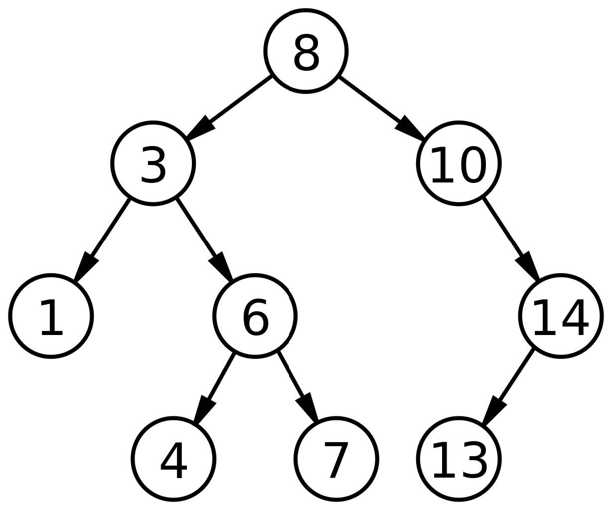

# 第十二章 `TreeMap`

这一章展示了二叉搜索树，它是个`Map`接口的高效实现。如果我们想让元素有序，它非常实用。

## 12.1 哈希哪里不对？

此时，你应该熟悉 Java 提供的`Map`接口和`HashMap`实现。通过使用哈希表来制作你自己的`Map`，你应该了解`HashMap`的工作原理，以及为什么我们预计其核心方法是常数时间的。

由于这种表现，`HashMap`被广泛使用，但并不是唯一的`Map`实现。有几个原因可能需要另一个实现：

哈希可能很慢，所以即使`HashMap`操作是常数时间，“常数”可能很大。
如果哈希函数将键均匀分配给子映射，效果很好。但设计良好的散列函数并不容易，如果太多的键在相同的子映射上，那么`HashMap`的性能可能会很差。
哈希表中的键不以任何特定顺序存储；实际上，当表增长并且键被重新排列时，顺序可能会改变。对于某些应用程序，必须或至少保持键的顺序，这很有用。

很难同时解决所有这些问题，但是 Java 提供了一个称为`TreeMap`的实现：

+   它不使用哈希函数，所以它避免了哈希的开销和选择哈希函数的困难。
+   在`TreeMap`之中，键被存储在二叉搜索树中，这使我们可以以线性时间顺序遍历键。
+   核心方法的运行时间与`log(n)`成正比，并不像常数时间那样好，但仍然非常好。

在下一节中，我将解释二进制搜索树如何工作，然后你将使用它来实现`Map`。另外，使用树实现时，我们将分析映射的核心方法的性能。

## 12.2 二叉搜索树

二叉搜索树（BST）是一个树，其中每个`node`（节点）包含一个键，并且每个都具有“BST 属性”：

+   如果`node`有一个左子树，左子树中的所有键都必须小于`node`的键。
+   如果`node`有一个右子树，右子树中的所有键都必须大于`node`的键。



图 12.1：二叉搜索树示例

图 12.1 展示了一个具有此属性的整数的树。这个图片来自二叉搜索树的维基百科页面，位于 <http://thinkdast.com/bst>，当你做这个练习时，你会发现它很实用。

根节点中的键为`8`，你可以确认根节点左边的所有键小于`8`，右边的所有键都更大。你还可以检查其他节点是否具有此属性。


在二叉搜索树中查找一个键是很快的，因为我们不必搜索整个树。从根节点开始，我们可以使用以下算法：

+   将你要查找的键`target`，与当前节点的键进行比较。如果他们相等，你就完成了。
+   如果`target`小于当前键，搜索左子树。如果没有，`target`不在树上。
+   如果`target`大于当前键，搜索右子树。如果没有，`target`不在树上。

在树的每一层，你只需要搜索一个子树。例如，如果你在上图中查找`target = 4`，则从根节点开始，它包含键`8`。因为`target`小于`8`，你走了左边。因为`target`大于`3`，你走了右边。因为`target`小于`6`，你走了左边。然后你找到你要找的键。

在这个例子中，即使树包含九个键，它需要四次比较来找到目标。一般来说，比较的数量与树的高度成正比，而不是树中的键的数量。

因此，我们可以计算树的高度`h`和节点个数`n`的关系。从小的数值开始，逐渐增加：

如果`h=1`，树只包含一个节点，那么`n=1`。
如果`h=2`，我们可以添加两个节点，总共`n=3`。
如果`h=3`，我们可以添加多达四个节点，总共`n=7`。
如果`h=4`，我们可以添加多达八个节点，总共`n=15`。

现在你可能会看到这个规律。如果我们将树的层数从`1`数到`n`，第`i`层可以拥有多达`2^(n-1)`个节点。`h`层的树共有`2^h-1`个节点。如果我们有：

```
n = 2^h - 1
```

我们可以对两边取以`2`为底的对数：

```
log2(n) ≈ h
```

意思是树的高度正比于`logn`，如果它是满的。也就是说，如果每一层包含最大数量的节点。

所以我们预计，我们可以以正比于`logn`的时间，在二叉搜索树中查找节点。如果树是慢的，即使是部分满的，这是对的。但是并不总是对的，我们将会看到。

时间正比于`logn`的算法是对数时间的，并且属于`O(logn)`的增长级别。
