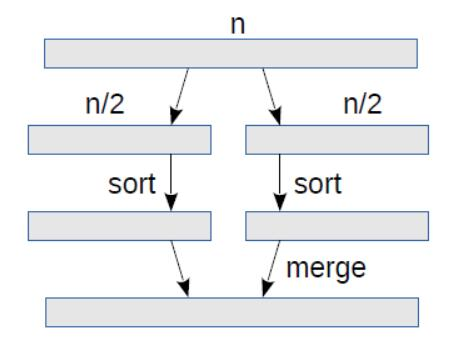
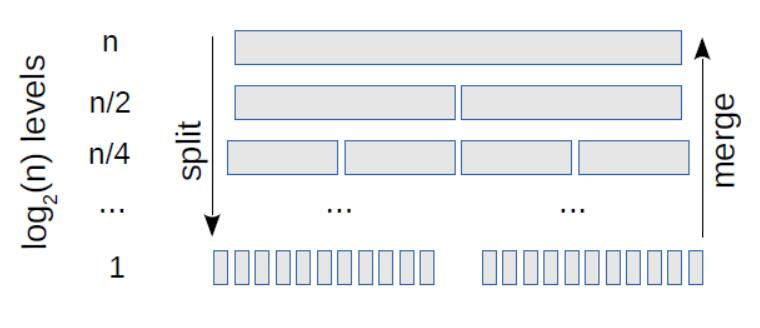

# 第十七章 排序

计算机科学领域过度痴迷于排序算法。根据 CS 学生在这个主题上花费的时间，你会认为排序算法的选择是现代软件工程的基石。当然，现实是，软件开发人员可以在很多年中，或者整个职业生涯中，不必考虑排序如何工作。对于几乎所有的应用程序，它们都使用它们使用的语言或库提供的通用算法。通常这样就行了。

所以如果你跳过这一章，不了解排序算法，你仍然是一个优秀的开发人员。但是有一些原因你可能想要这样：

+   尽管有绝大多数应用程序都可以使用通用算法，但你可能需要了解两种专用算法：基数排序和有界堆排序。
+   一种排序算法，归并排序，是一个很好的教学示例，因为它演示了一个重要和实用的算法设计策略，称为“分治”。此外，当我们分析其表现时，你将了解到我们以前没有看到的增长级别，即线性对数。最后，一些最广泛使用的算法是包含归并排序的混合体。
+   了解排序算法的另一个原因是，技术面试官喜欢询问它们。如果你想要工作，如果你能展示 CS 文化素养，就有帮助。

因此，在本章中我们将分析插入排序，你将实现归并排序，我将给你讲解基数排序，你将编写有界堆排序的简单版本。

## 17.1 插入排序

我们将从插入排序开始，主要是因为它的描述和实现很简单。它不是很有效，但它有一些补救的特性，我们将看到它。


我们不在这里解释算法，建议你阅读 <http://thinkdast.com/insertsort> 中的插入排序的维基百科页面 ，其中包括伪代码和动画示例。当你理解了它的思路再回来。

这是 Java 中插入排序的实现：

```java
public class ListSorter<T> {

    public void insertionSort(List<T> list, Comparator<T> comparator) {

        for (int i=1; i < list.size(); i++) {
            T elt_i = list.get(i);
            int j = i;
            while (j > 0) {
                T elt_j = list.get(j-1);
                if (comparator.compare(elt_i, elt_j) >= 0) {
                    break;
                }
                list.set(j, elt_j);
                j--;
            }
            list.set(j, elt_i);
        }
    }
}
```

我定义了一个类，`ListSorter`作为排序算法的容器。通过使用类型参数`T`，我们可以编写一个方法，它在包含任何对象类型的列表上工作。

`insertionSort`需要两个参数，一个是任何类型的`List`，一个是`Comparator`，它知道如何比较类型`T`的对象。它对列表“原地”排序，这意味着它修改现有列表，不必分配任何新空间。

下面的示例演示了，如何使用`Integer`的`List`对象，调用此方法：

```java
        List<Integer> list = new ArrayList<Integer>(
            Arrays.asList(3, 5, 1, 4, 2));

        Comparator<Integer> comparator = new Comparator<Integer>() {
            @Override
            public int compare(Integer elt1, Integer elt2) {
                return elt1.compareTo(elt2);
            }
        };

        ListSorter<Integer> sorter = new ListSorter<Integer>();
        sorter.insertionSort(list, comparator);
        System.out.println(list);
```

`insertionSort`有两个嵌套循环，所以你可能会猜到，它的运行时间是二次的。在这种情况下，一般是正确的，但你做出这个结论之前，你必须检查，每个循环的运行次数与`n`，数组的大小成正比。

外部循环从`1`迭代到`list.size()`，因此对于列表的大小`n`是线性的。内循环从`i`迭代到`0`，所以在`n`中也是线性的。因此，两个循环运行的总次数是二次的。

如果你不确定，这里是证明：

第一次循环中，`i = 1`，内循环最多运行一次。
第二次，`i = 2`，内循环最多运行两次。
最后一次，`i = n - 1`，内循环最多运行`n`次。

因此，内循环运行的总次数是序列`1, 2, ..., n - 1`的和，即`n(n - 1)/2`。该表达式的主项（拥有最高指数）为`n^2`。

在最坏的情况下，插入排序是二次的。然而：

+   如果这些元素已经有序，或者几乎这样，插入排序是线性的。具体来说，如果每个元素距离它的有序位置不超过`k`个元素，则内部循环不会运行超过`k`次，并且总运行时间是`O(kn)`。
+   由于实现简单，开销较低；也就是，尽管运行时间是`an^2`，主项的系数`a`，也可能是小的。

所以如果我们知道数组几乎是有序的，或者不是很大，插入排序可能是一个不错的选择。但是对于大数组，我们可以做得更好。其实要好很多。

## 17.2 练习 14

归并排序是运行时间优于二次的几种算法之一。同样，不在这里解释算法，我建议你阅读维基百科 <http://thinkdast.com/mergesort>。一旦你有了想法，反回来，你可以通过写一个实现来测试你的理解。


在本书的仓库中，你将找到此练习的源文件：

+   `ListSorter.java`
+   `ListSorterTest.java`

运行`ant build`来编译源文件，然后运行`ant ListSorterTest`。像往常一样，它应该失败，因为你有工作要做。

在`ListSorter.java`中，我提供了两个方法的大纲，`mergeSortInPlace`以及`mergeSort`：

```java
    public void mergeSortInPlace(List<T> list, Comparator<T> comparator) {
        List<T> sorted = mergeSortHelper(list, comparator);
        list.clear();
        list.addAll(sorted);
    }

    private List<T> mergeSort(List<T> list, Comparator<T> comparator) {
       // TODO: fill this in!
       return null;
    }
```

这两种方法做同样的事情，但提供不同的接口。`mergeSort`获取一个列表，并返回一个新列表，具有升序排列的相同元素。`mergeSortInPlace`是修改现有列表的`void`方法。

你的工作是填充`mergeSort`。在编写完全递归版本的合并排序之前，首先要这样：

+   将列表分成两半。
+   使用`Collections.sort`或`insertionSort`来排序这两部分。
+   将有序的两部分合并为一个完整的有序列表中。

这将给你一个机会来调试用于合并的代码，而无需处理递归方法的复杂性。

接下来，添加一个边界情况（请参阅 < http://thinkdast.com/basecase> ）。如果你只提供一个列表，仅包含一个元素，则可以立即返回，因为它已经有序。或者如果列表的长度低于某个阈值，则可以使用`Collections.sort`或`insertionSort`。在进行前测试边界情况。

最后，修改你的解决方案，使其进行两次递归调用来排序数组的两个部分。当你使其正常工作，`testMergeSort`和`testMergeSortInPlace`应该通过。

## 17.3 归并排序的分析

为了对归并排序的运行时间进行划分，对递归层级和每个层级上完成多少工作方面进行思考，是很有帮助的。假设我们从包含`n`个元素的列表开始。以下是算法的步骤：

+   生成两个新数组，并将一半元素复制到每个数组中。
+   排序两个数组。
+   合并两个数组。

图 17.1 显示了这些步骤。



图 17.1：归并排序的展示，它展示了递归的一个层级。

第一步复制每个元素一次，因此它是线性的。第三步也复制每个元素一次，因此它也是线性的。现在我们需要弄清楚步骤`2`的复杂性。为了做到这一点，查看不同的计算图片会有帮助，它展示了递归的层数，如图 17.2 所示。



图 17.2：归并排序的展示，它展示了递归的所有层级。

在顶层，我们有`1`个列表，其中包含`n`个元素。为了简单起见，我们假设`n`是`2`的幂。在下一层，有`2`个列表包含`n/2`个元素。然后是`4`个列表与`n/4`元素，以此类推，直到我们得到`n`个列表与`1`元素。

在每一层，我们共有`n`个元素。在下降的过程中，我们必须将数组分成两半，这在每一层上都需要与`n`成正比的时间。在回来的路上，我们必须合并`n`个元素，这也是线性的。

如果层数为`h`，算法的总工作量为`O(nh)`。那么有多少层呢？有两种方法可以考虑：

+   我们用多少步，可以将`n`减半直到`1`？
+   或者，我们用多少步，可以将`1`加倍直到`n`？

第二个问题的另一种形式是“`2`的多少次方是`n`”？

```
2^h = n
```

对两边取以`2`为底的对数：

```
h = log2(n)
```

所以总时间是`O(nlogn)`。我没有纠结于对数的底，因为底不同的对数差别在于一个常数，所以所有的对数都是相同的增长级别。


`O(nlogn)`中的算法有时被称为“线性对数”的，但大多数人只是说`n log n`。


事实证明，`O(nlogn)`是通过元素比较的排序算法的理论下限。这意味着没有任何“比较排序”的增长级别比`n log n`好。请参见 <http://thinkdast.com/compsort>。

但是我们将在下一节中看到，存在线性时间的非比较排序！
